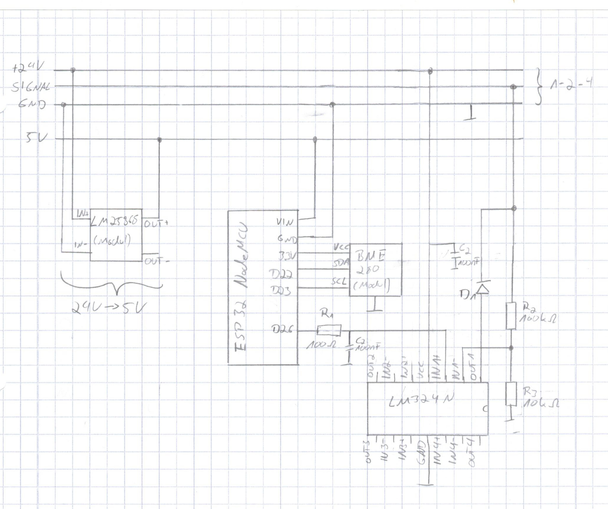

# Junkers_1-2-4_ESP32
Ein ESP32 Arduino Sketch für die Steuerung einer Junkers Gastherme an einer 1-2-4 Schnittstelle. Mehr dazu hier: https://robin.meis.space/2019/07/03/junkers-therme-mit-wlan/

## Schaltplan
Der Schalplan ist von https://wiki.fhem.de/wiki/Junkers_Therme_Stetigregelung#Vorbereitung_3 abgeleitet und befindet sich in der Datei `schematic.jpg`

## Firmware
Die Firmware befindet sich im Verzeichnis `firmware/`. Vor dem Flashen der Firmware muss die Datei `config.h` angelegt werden. In der Datei `config-example.h` befindet sich eine Vorlage, bei der die eigenen WLAN Zugangsdaten und der MQTT eingetragen werden müssen.
